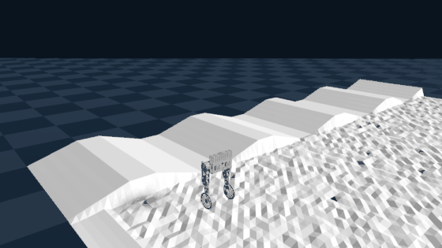
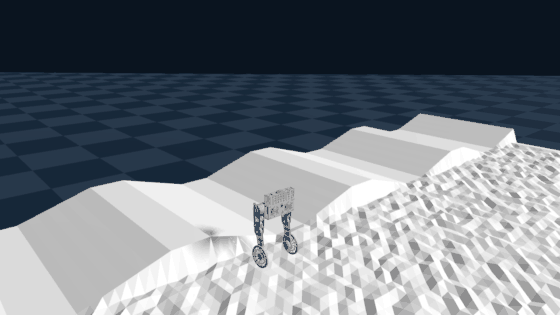
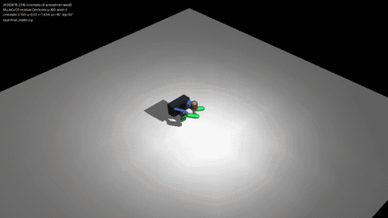
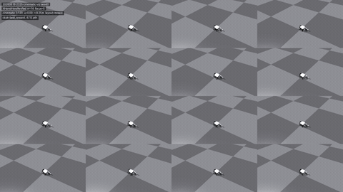
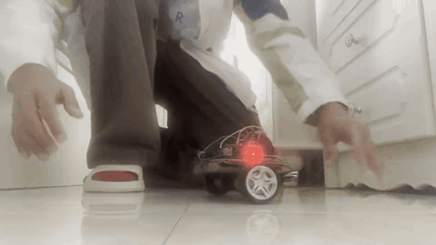
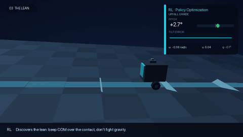
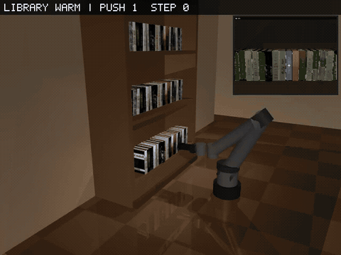
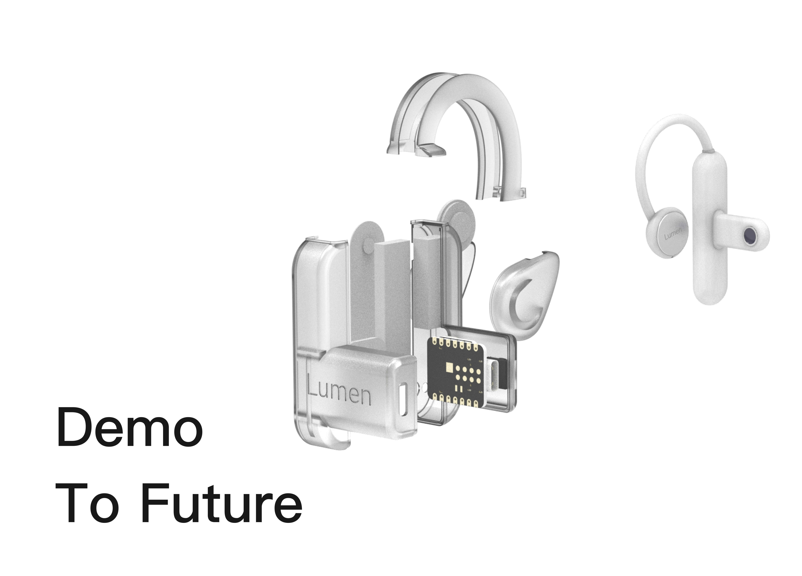
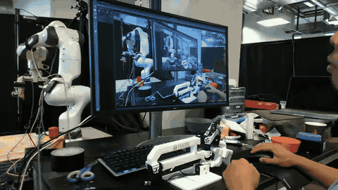
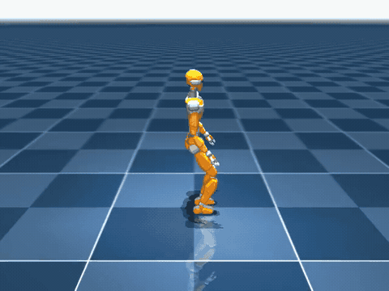

# Peixing You

MS Robotics at UC San Diego. I build physical robots and the software that makes AI agents trustworthy — from dexterous hands and teleoperation to production verification products and multi-agent simulation backends.

**[Homepage](https://ypx19.github.io)** · [Email](mailto:peyou@ucsd.edu) · [LinkedIn](https://www.linkedin.com/in/peixing-you-64a577300) · [Google Scholar](https://scholar.google.com/citations?user=NeJWdkcAAAAJ)

| | |
|---|---|
| **Education** | MS Robotics, UC San Diego (GPA 3.8) · BS MSE + BS CS, Tsinghua University |
| **Focus** | Manipulation, control, dexterous hand, perception, LLM agents, full-stack AI products |
| **Highlight** | NeurIPS 2022 Spotlight · IEEE CYBER 2024 Best Poster |
| **Based in** | San Diego, CA |

## About

I’m a robotics graduate student advised by [Prof. Xiaolong Wang](https://xiaolonw.github.io/) at UC San Diego, with dual bachelor’s degrees in Materials Science and Computer Science from Tsinghua University. My work sits at the seam of embodiment and intelligence: optimizing robot hardware for the real world, shipping LLM backends that survive long-context failure modes, and turning early product ideas into usable systems.

Lately that means contributing to [Transnode AI](https://www.transnode.ai/)’s [AuthenlyUSA](https://authenlyusa.com/) verification product, hardening the [Agent Arena](https://agent-arena.tech/) simulation stack, and prototyping low-cost dexterous hands and teleoperation platforms in the lab.

## Experience

### [Transnode AI](https://www.transnode.ai/) — CTO & Co-Founder, AuthenlyUSA
*San Diego, CA · Jul 2026 – Present*
- Shipping full-stack features on [AuthenlyUSA](https://authenlyusa.com/), Transnode’s AI credential & identity verification product for hiring and compliance workflows.
- Built admin review tooling (rejection notes, secondary staff review, document filters, expiry reminders) used in live verification operations.
- Improved candidate subscription & billing UX — cancel-at-period-end, expiry reset, pricing/CTA consistency — on a production React/TypeScript SaaS codebase.

### [Agent Arena](https://agent-arena.tech/) — Member of Technical Staff
*Cambridge, MA · Mar 2026 – Present*
- Translated product needs into an LLM-powered multi-agent simulation system with Python & FastAPI; work supported acquisition of real paid startup customers.
- Integrated MinIO (S3-compatible) object storage for scalable multi-file workflows across simulation sessions.
- Diagnosed long-context LLM blocking failures and implemented timeout/recovery logic, cutting worst-case pipeline blocking by **96.7%** (300s → 10s).

### UC San Diego — Research, Dexterous Hand & Teleoperation
*[Wang Lab](https://xiaolonw.github.io/) · Sep 2025 – Present*
- Built a neural optimization pipeline (PyTorch + NVIDIA Warp) using forward kinematics and human finger-motion data to explore low-cost dexterous hand designs.
- Closed the Sim2Real gap with SDF-based collision metrics; cut inter-finger collision cases in the physical 3D-printed prototype by **50%**.
- Assembled a Gello-based teleoperation platform (YAM arm, Dynamixel actuators) and upstreamed CAD/spec fixes via open-source PR.

### AdventureX 2025 — Hardware–Software Lead, Lumen
*Hangzhou, China · Jul 2025 – Aug 2025*
- Built a vision-enabled AI earphone prototype in three days: ESP32 camera, Bluetooth, speaker output, mobile triggering, and LLM connectivity.
- Led end-to-end hardware–software integration (ring wake-up, capture, BLE chunked transfer, phone-side processing).

### Baidu — LLM Agent Engineering / Testing Intern
*Beijing, China · Apr 2024 – Jun 2024*
- Built evaluation workflows and result-checking logic for an LLM spreadsheet-processing agent.
- Scaled multi-threaded Python evaluation pipelines and structured test datasets to accelerate R&D decisions.

### AIR, Tsinghua University — Research Assistant, Perception & 3D Learning
*Beijing, China · 2020 – 2024*
- Designed an LLM-based active-perception policy with memory for indoor object localization (~3× efficiency vs. strongest baseline SPL).
- Co-developed SNAKE (**NeurIPS 2022 Spotlight**): shape-aware self-supervised 3D keypoint fields with up to 85% repeatability.
- Built the IEEE CYBER 2024 Best Poster interactive grasping pipeline (ROS + RGB-D + point clouds) for crowded shelf retrieval.

## Selected projects

<table>
  <tr>
    <td valign="top" width="50%">
      
      
      
<strong>Wheel-Legged Robot (CJ-003)</strong> 
      Genesis · MuJoCo · RL · Locomotion

      
Open-source wheel-legged biped with a pretrained PPO policy. Genesis GPU eval stays upright on rough / circular terrains; full motion gallery covers walk, turn, crouch, moonwalk, and lean.

      
<a href="https://github.com/ypx19/wheel-leg-robotic">GitHub</a> · <a href="https://ypx19.github.io/wheel-leg-robotic/">Live demo</a> · <a href="https://ypx19.github.io/wheel-leg-robotic/#motions">Motions</a>

    </td>
    <td valign="top" width="50%">
      
      
      
<strong>Rod Rotation MVP</strong> 
      MuJoCo · IsaacGym · RL · Manipulation

      
RL-trained three-finger in-hand rotation under tip constraints — a stable twisting gait built for future dexterous tool use.

      
<a href="https://github.com/ypx19/allegro_rod_mvp">GitHub</a> · <a href="https://ypx19.github.io/allegro_rod_mvp/demo.html">Interactive demo</a>

    </td>
  </tr>
  <tr>
    <td valign="top" width="50%">
      
      
      
<strong>Self-Balancing Robot</strong> 
      Embedded · PID · IL/RL · Control

      
Arduino + IMU + encoder dual-loop PID from scratch — then the same plant in sim, with imitation and RL learning to lean into a grade.

      
<a href="https://github.com/ypx19/self-balancing-robot">GitHub</a> · <a href="https://ypx19.github.io/self-balancing-robot/">Project page</a>

    </td>
    <td valign="top" width="50%">
      
      
<strong>Interactive Grasping in Crowds</strong> 
      ROS · Manipulation · Best Poster

      
Closed-loop retrieval in cluttered shelves — perception, interactive planning, and grasp execution. IEEE CYBER 2024 Best Poster.

      
<a href="https://github.com/ypx19/interactive-grasping-in-crowd">GitHub</a> · <a href="https://ieeexplore.ieee.org/document/10749016/">IEEE paper</a> · <a href="https://ypx19.github.io/interactive-grasping/">Project page</a>

    </td>
  </tr>
  <tr>
    <td valign="top" width="50%">
      
      
<strong>AI-Powered Earphone Prototype</strong> 
      Hackathon · ESP32 · LLM · Advx25

      
Three-day AdventureX 2025 build: camera, Bluetooth, speaker, and LLM connectivity for vision-aware conversational assistance.

      
<a href="https://github.com/ypx19/Lumen">GitHub</a>

    </td>
    <td valign="top" width="50%">
      
      
<strong>Gello Robot for Teleoperation</strong> 
      Teleoperation · Hardware · Data collection

      
Low-cost Gello-style teleoperation device integrating motors, brackets, 3D-printed structure, and calibration for human demonstration collection toward imitation learning.

    </td>
  </tr>
  <tr>
    <td valign="top" width="50%">
      
      
<strong>Humanoid Walking in MuJoCo</strong> 
      MuJoCo · Locomotion

      
Studying balance, contact forces, and whole-body control strategies for stable humanoid locomotion in simulation.

    </td>
    <td valign="top" width="50%">
      
<strong>Dual-Friction-Wheel Launcher</strong> 
      Embedded · Mech · 3rd Prize

      
Remote-control siege robot with dual friction-wheel launcher — chassis, transmission, motor control, and power. Tsinghua SIEGE 3rd Prize.

    </td>
  </tr>
  <tr>
    <td valign="top" width="50%">
      
<strong>Optimization-Driven Robotic Hand</strong> 
      Warp · Optimization · Sim2Real

      
Neural design search for printable dexterous hands; SDF collision objectives to make physical prototypes safer for teleoperation. <em>Coming soon.</em>

    </td>
  </tr>
</table>

## Skills

**Languages** — Python, C++, TypeScript, Java, SQL, Embedded C  
**Frontend / Backend** — React, REST APIs, FastAPI, auth, databases, object storage, logging, timeout handling  
**Robotics & Sim** — ROS, MuJoCo, Isaac Gym, PID/LQR, manipulation, navigation, diffusion policy, VLA  
**AI / ML** — LLM agents, PEFT, representation learning, RL, imitation learning, PyTorch, NVIDIA Warp  
**Embedded** — ISRs, PWM motor control, IMU estimation, Bluetooth, hardware–software integration  
**Infra** — Linux, Git, Docker, AWS, MinIO / S3

## Publications & honors

1. Peixing You, Hang Li, et al. (2024). “An Adapter for Interactive Object Retrieval on the Shelf.” *IEEE CYBER 2024*. [doi:10.1109/CYBER63482.2024.10749016](https://ieeexplore.ieee.org/document/10749016/)
2. Peixing You, Chengliang Zhong, et al. (2022). “SNAKE: Shape-aware Neural 3D Keypoint Field.” *NeurIPS 2022* (Spotlight). [PDF](https://proceedings.neurips.cc/paper_files/paper/2022/file/2e3eccb54649186564ad6627ed80848c-Paper-Conference.pdf)

- IEEE CYBER 2024 Best Poster Award
- NeurIPS 2022 Spotlight Paper
- Tsinghua Science & Technology Innovation Excellence Scholarship (Top 1%)
- Tsinghua Learning Progress Scholarship (Top 1%)
- Tsinghua Siege Robotic Competition — Third Prize

## Contact

Open to research collaborations, robotics / AI systems roles, and interesting prototype problems.

**[peyou@ucsd.edu](mailto:peyou@ucsd.edu)** · [Homepage](https://ypx19.github.io) · [LinkedIn](https://www.linkedin.com/in/peixing-you-64a577300) · [Google Scholar](https://scholar.google.com/citations?user=NeJWdkcAAAAJ)
