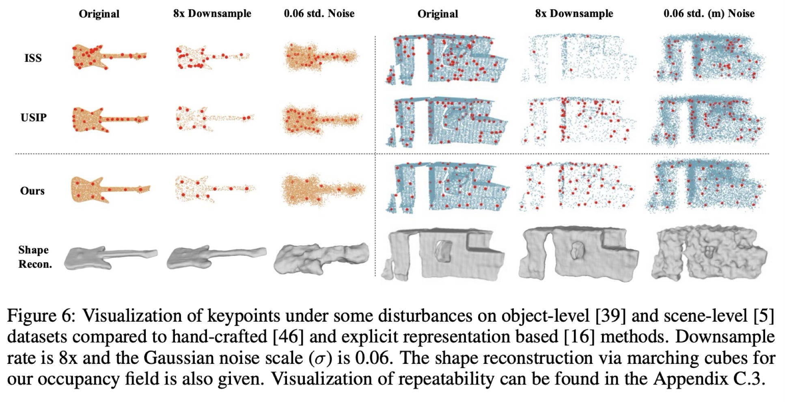
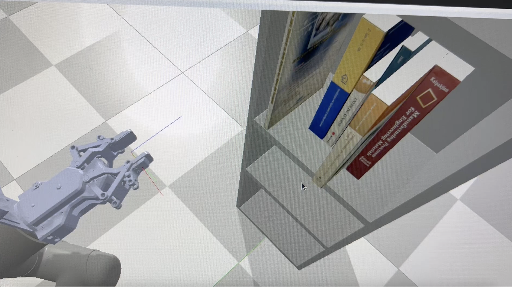

# Hi there 👋

---

## Peixing You

📧 [ypxypxypx700@gmail.com](mailto:ypxypxypx700@gmail.com)  
💻 [GitHub](https://github.com/ypx19)  
🎓 [Google Scholar](https://scholar.google.com/citations?user=NeJWdkcAAAAJ)  

---

I received my **B.S. in Material Science and Engineering** and **B.S. in Computer Science** from **Tsinghua University** (Aug. 2019 – Jun. 2024).  
Currently, I am pursuing an **M.S. in Robotics (ECE)** at **University of California, San Diego** (Sep. 2025 – present).  

---

## Research & Work Interests

🤖 **AI + Robotics / Embodied Intelligence**  
- Passionate about developing robots that are **intelligent, safe, and responsive**.  
- Interested in **manipulation, locomotion, navigation, and robot design optimization**.  

---

## 🔙 Past Work
### Previously worked on **manipulation, locomotion, and navigation**.

<table>
  <tr>
    <td style="width:50%; vertical-align:top;">
      
<strong>Self-balancing robot</strong> 
      PID + LQR control, stm32 based

      <video src="https://github.com/user-attachments/assets/8e97b14f-d94a-4447-a250-16d967f622a3" width="100%" controls playsinline muted loop></video>
    </td>
    <td style="width:50%; vertical-align:top;">
      
<strong>3d key point detection</strong> 
      self-supervised learning, point cloud perception

      
    </td>
  </tr>
</table>

<table>
  <tr>
    <td style="width:50%; vertical-align:top;">
      
<strong>interactive grasping</strong> 
      interactive manipulation in a complex scenario

      <video src="https://github.com/user-attachments/assets/8e97b14f-d94a-4447-a250-16d967f622a3" width="100%" controls playsinline muted loop></video>
      
    </td>
    <td style="width:50%; vertical-align:top;">
      
<strong>hardware AI earphone: Smart Life Recorder (AdventureX 2025 Hackathon) </strong> 
      AI earphone that capture and record your routine life and assist you with AI

      
    </td>
  </tr>
</table>

## 🔥 Current Work
- Research on **robotic hand design optimization** in [Xiaolong Wang’s lab](https://xiaolonw.github.io/group.html) at UCSD.  

## 🚀 Future Plans
- Continue exploring **embodied intelligence** and **AI-driven robot design**.  
- Seek opportunities to collaborate on **robot learning, control, and human–robot interaction**.  

---

## Publications

1. [Peixing You et al., "An Adapter for Interactive Object Retrieval on the Shelf," 2024 IEEE 14th International Conference on CYBER Technology in Automation, Control, and Intelligent Systems (CYBER), Copenhagen, Denmark, 2024, pp. 505-510, doi: 10.1109/CYBER63482.2024.10749016. keywords: {Visualization;Automation;Grasping;Control systems;Planning;Object recognition;Intelligent systems;Robots}](https://scholar.google.com/citations?view_op=view_citation&hl=zh-CN&user=NeJWdkcAAAAJ&citation_for_view=NeJWdkcAAAAJ:u-x6o8ySG0sC)

2. [Peixing You et al., “Snake: Shape-Aware Neural 3d Keypoint Field.” Advances in Neural Information Processing Systems., vol. 35, 2022.](https://proceedings.neurips.cc/paper_files/paper/2022/file/2e3eccb54649186564ad6627ed80848c-Paper-Conference.pdf)
   

---

## News

- 2025.10.03: I'm currently Enrolled in courses: **ECE271A**, **ECE250**, **ECE143** in UCSD.  

- 2025.10.03: I'm studying a [humanoid locomotion project](https://github.com/rohanpsingh/LearningHumanoidWalking)  

<table>
  <tr>
    <td style="width:50%; vertical-align:top;">
      <video src="https://github.com/user-attachments/assets/5bbd67fa-1220-4100-92e8-de8a640f325f" width="48%" grounf gait></video>
    </td>
    <td style="width:50%; vertical-align:top;">
      <video src="https://github.com/user-attachments/assets/f78e691d-75a1-4a27-9ad8-fcd41158c0a1" width="48%" aerial gait></video>
    </td>
  </tr>
</table>

- 2025.09.28 I joined [Xiaolong Wang’s lab](https://xiaolonw.github.io/group.html) at UCSD to conduct research in dexterous hand manipulation.

---

## Awards

🏅 **Sep. 2024** — IEEE-CYBER 2024 Finalist of Best Poster Award  
🏅 **Mar. 2023** — Tsinghua Science and Tech Innovation Excellence Award (Top 10%)  
🏅 **Mar. 2023** — Tsinghua Learning Progress Scholarship (Top 10%)  
⚽ **May. 2022** — Tsinghua Ma YueHan Soccer Cup (3rd)  
📐 **Dec. 2020** — Chinese College Student Mathematics Competition (3rd)  
⚙️ **May. 2020** — Tsinghua Mechanical Engineering Design Competition (3rd)  

---

## Online Certificates

- [Improving Deep Neural Networks: Hyperparameter Tuning, Regularization and
Optimization(Coursera, Andrew Ng)](https://www.coursera.org/account/accomplishments/verify/WMFNDEKNGLHJ?utm_source=link&utm_medium=certificate&utm_content=cert_image&utm_campaign=pdf_header_button&utm_product=course)

- [Neural Networks and Deep Learning(Coursera, Andrew Ng)](https://www.coursera.org/account/accomplishments/verify/VSOTKC0DXVA5?utm_source=link&utm_medium=certificate&utm_content=cert_image&utm_campaign=sharing_cta&utm_product=course)

- [Structuring Machine Learning Projects(Coursera, Andrew Ng)](https://www.coursera.org/account/accomplishments/verify/C57EMMJZGM4B?utm_source=link&utm_medium=certificate&utm_content=cert_image&utm_campaign=sharing_cta&utm_product=course)

